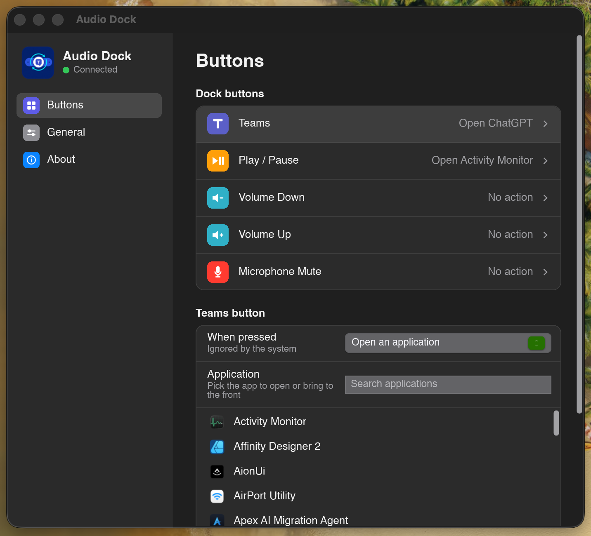

# MS Audio Dock Remapper for macOS

Give every button on the Microsoft Audio Dock a job of your choosing on
macOS: the Teams key, Play/Pause, Volume Up, Volume Down and Microphone Mute
can each open an application, open a URL, run a command or play a sound.



Microsoft ships no macOS software for the Dock, so its Teams key does nothing
on a Mac and the other keys are locked to their default meaning. This app
listens to the Dock's HID reports read-only (nothing is written to the device,
no driver, no firmware change), lives in the menu bar, and applies changes the
moment you make them.

## Features

- **Every button is remappable.** Teams, Play/Pause, Volume Up/Down and Mic
  Mute each get their own action: open an application, open a URL or run a
  command with arguments, play a sound, or nothing.
- **Remapped media keys do only your action.** Once a media key has an
  action, the app takes the Dock over from the system; keys you leave alone are
  handed back to macOS and keep working (see *Permissions*).
- **Settings window in the style of macOS System Settings**: sidebar,
  grouped rows, native controls, light and dark mode. No Save button.
- **Application picker** that searches the Applications folders and shows each
  app's real icon; launching brings an already-running app to the front.
- **Menu bar app**: no Dock icon, reopen or quit from the status item;
  optional launch at login, optionally hidden.
- **Hot-plug aware**: unplug and replug the Dock and the app reconnects by
  itself.
- **Read-only, permission-light**: no Input Monitoring, no kernel extension.
  Accessibility access is requested only when you bind a media key.

## Requirements

- macOS 11 or later, Apple silicon or Intel
- A Microsoft Audio Dock (USB VID `045E`, PID `084D`)

## Install

Download the latest `MS-Audio-Dock-Remapper-<version>-macos.zip` from the
[Releases page](../../releases/latest), unzip it and move the app to
`/Applications`. The bundle is signed ad hoc (not notarized), so on first
launch right-click the app and choose *Open*. Every push to `main` also
leaves a bundle as a GitHub Actions artifact for testing.

To build from source:

```bash
brew install rustup && rustup default stable   # once
./build-macos.sh
```

This produces `target/release/MS Audio Dock Remapper.app`. Copy it to
`/Applications` (or `~/Applications`) and open it. Pass a Developer ID
identity as the first argument of the script to sign for distribution.

## Using it

1. Connect the Dock. The status dot in the sidebar turns green.
2. In **Buttons**, select a button, then choose what happens **When pressed**.
   For *Open an application* pick one from the searchable list; for *Open a URL
   or run a command* type the URL or program path and optional arguments.
3. Press **Test** to try it, then press the button on the Dock.

Everything saves immediately. Closing the window hides it; reopen it from the
menu bar icon. **General** holds the switches for running actions at all, the
confirmation sound, launch at login and starting hidden. **About** shows the
device identity and the number of matching HID collections.

## Permissions

The Dock's Teams key lives in a vendor HID collection that macOS leaves open to
applications, so the default mode needs no permission at all.

macOS also acts on the Dock's Play/Pause and Volume keys. To make a remapped
media key do *only* your action, the app has to open the Dock exclusively and
then re-post the system media keys it intercepts for buttons you left alone.
Re-posting input needs **Accessibility** access. The app asks for it the first
time you give a media key an action, switches over by itself once it is granted
(no restart), and until then keeps the shared mode so nothing stops working.
One trade-off: holding a volume key no longer auto-repeats in exclusive mode.

## How it works

The Dock exposes several HID collections on one USB interface. macOS delivers
all of them through a single device handle, so the app tells the buttons apart
by report ID. Captured from a real Dock on macOS 26:

| Button | Collection | Press report |
| --- | --- | --- |
| Teams | vendor page `FF99`, usage `0001` | `9B 01` (release `9B 00`) |
| Volume Up / Down | consumer control | `01 01` / `01 02` |
| Play / Pause | consumer control | `04 08` |
| Microphone Mute | telephony | `08 01` / `08 00` (latched state) |

Reading goes through [hidapi](https://github.com/libusb/hidapi) in shared
mode, or in exclusive mode once a media key is bound. Actions run on a worker
thread so a slow launch never delays the next press. The UI is
[Slint](https://slint.dev) with its native macOS widget style.

## Configuration

Settings live in readable JSON at

```text
~/Library/Application Support/ms-audio-dock-remapper/config.json
```

Files written by the original Windows app (one action for the Teams key) are
migrated automatically.

## Windows

The Windows backend inherited from the original project is still in the tree
(`src/platform/windows.rs`, Raw Input for the Teams key only, tray icon,
registry autostart, Inno Setup installer via the manual release workflow). It
compiles against the same shared UI and config code, but this repository is
developed and tested on macOS only.

## Development

See [CONTRIBUTING.md](CONTRIBUTING.md). The macOS CI workflow runs `cargo fmt`,
`cargo test`, `cargo clippy -D warnings`, builds the bundle, checks its
signature and `Info.plist`, starts it headless for five seconds and uploads the
zipped bundle. Pushing a tag `vX.Y.Z` that matches the version in `Cargo.toml`
runs the release workflow, which repeats those checks and publishes the zip
plus a SHA-256 checksum file as a GitHub Release.

## Origin and license

This project started as a port of
[Masterain's MS Audio Dock Teams Key Remapper](https://github.com/Masterain98/ms-audio-dock-remapper)
for Windows, and keeps its Windows backend, Slint foundation and MIT license.
The macOS backend, the per-button action model, the media-key takeover, the
application picker, the redesigned settings window and the macOS packaging
and CI were written for this repository by Hung Ngo. The full history is in
the git log.

Released under the [MIT License](LICENSE), which carries both copyright
notices.
